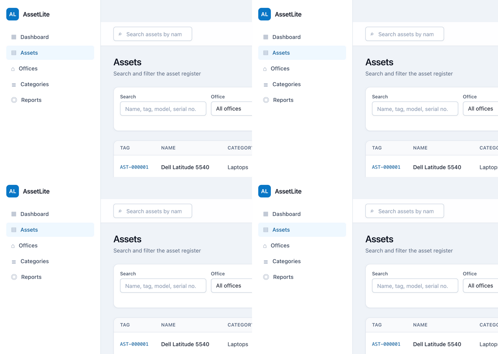
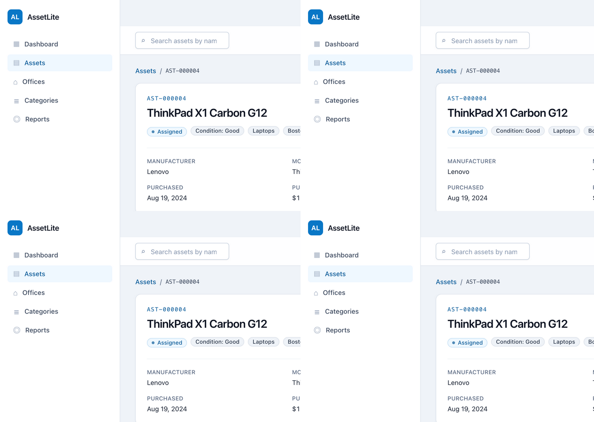

# AssetLite

[](https://learn.microsoft.com/en-us/dotnet/core/whats-new/dotnet-10/overview)
[](https://angular.dev)
[](https://www.typescriptlang.org)
[](https://aspire.dev)
[](LICENSE)

Full-stack **IT asset & inventory management**: an ASP.NET Core Web API built with
Domain-Driven Design and Clean Architecture, an Angular 21 signals-first SPA with Tailwind CSS
v4, and .NET Aspire orchestration. Track computers, monitors, laptops, tablets and any
equipment across a **hierarchy of offices** (HQ → regions → sites), register **and correct**
assets through their lifecycle, generate **scannable
barcode + QR labels**, search everything fast, and **export the asset register to Excel and
PDF**.

| Asset list | Asset label (barcode + QR) |
|:---:|:---:|
|  |  |

> This is a personal reference application - a deliberate exercise in shipping a complete,
> tested, full-stack product slice. It pairs with
> [LedgerLite](https://github.com/Alex5350/ledgerlite) (REST/DDD),
> [LedgerLite Web](https://github.com/Alex5350/ledgerlite-web) (Blazor) and
> [LeaveLite MCP](https://github.com/Alex5350/leavelite-mcp) as a set.

## Getting started

Prerequisites: [.NET 10 SDK](https://dotnet.microsoft.com/download/dotnet/10.0),
[Node.js 22+](https://nodejs.org). Nothing else - SQLite migrates and seeds itself
(7 offices, 7 categories, 45 assets across every lifecycle state).

```bash
git clone https://github.com/Alex5350/assetlite.git
cd assetlite

# 1. Backend + Aspire dashboard (terminal 1) - API on http://localhost:5060
dotnet run --project src/AssetLite.AppHost

# 2. Frontend (terminal 2) - http://localhost:5070
cd frontend && npm install && npm start
```

The Aspire dashboard URL prints in terminal 1 (logs, traces and health for the API). Prefer
running the API alone? `dotnet run --project src/AssetLite.Api`. Why the SPA isn't an Aspire
resource is an honest, evidence-backed story in
[ADR 0002](docs/adr/0002-aspire-orchestration.md).

### Tests

```bash
dotnet test                          # 323 backend tests (no setup)
cd frontend && ng test --watch=false # 59 Angular tests (Vitest, no browser needed)
```

## What it demonstrates

| Area | Highlights |
|---|---|
| **Domain-Driven Design** | Zero-dependency domain layer: `Asset` aggregate with a full lifecycle state machine and typed error codes, `Office` hierarchy rules behind a domain service, value objects (`AssetTag`, `Money`), domain events, specifications |
| **Clean Architecture** | Domain ← Application (CQRS handlers, ports) ← Infrastructure (EF Core 10 + SQLite) ← API; the domain tests run on pure data with nothing installed |
| **ASP.NET Core Web API** | Controllers with RFC 9457 ProblemDetails carrying domain codes (400/404/409), OpenAPI + Scalar, integration tests over `WebApplicationFactory` |
| **Barcode generation** | Hand-rolled **Code 128 SVG encoder** verified against a computed known vector, plus QR labels encoding the public asset URL - zero barcode dependencies |
| **Excel & PDF exports** | ClosedXML register with styled totals; QuestPDF landscape report with headers and page numbers - generated server-side, downloadable from the UI |
| **Angular 21** | Signals everywhere, zoneless change detection, new control flow, standalone lazy routes, typed models mirrored from the API DTOs |
| **Tailwind CSS v4** | Design tokens (status colors for the five lifecycle states) and a small component layer over utilities |
| **Testing** | 323 backend (domain/application/integration incl. byte-level `%PDF`/`PK` export checks) + 59 frontend - the frontend suite caught two real bugs (documented) |
| **Aspire** | AppHost + ServiceDefaults: dashboard, OpenTelemetry, health - with a documented, evidence-based scope decision |

## Architecture

```
src/
├── AssetLite.Domain/            # Zero packages: aggregates, value objects,
│   │                            #   lifecycle state machine, domain events
├── AssetLite.Application/       # 19 CQRS use cases, ports, ErrorOr boundary mapping
├── AssetLite.Infrastructure/    # EF Core 10 + SQLite, Code 128 + QR labels,
│   │                            #   ClosedXML/QuestPDF exports, seeding
├── AssetLite.Api/               # Controllers (18 routes), ProblemDetails, OpenAPI
├── AssetLite.AppHost/           # Aspire orchestration (API + dashboard)
└── AssetLite.ServiceDefaults/   # OpenTelemetry, service discovery, resilience
frontend/                        # Angular 21 SPA: signals, zoneless, Tailwind v4
tests/                           # 197 domain · 84 application · 42 integration
frontend/src/app/**/*.spec.ts    # 59 Vitest specs
```

Decisions and the challenges behind them - controllers vs. minimal APIs, Aspire's scope,
TypeScript 7 (evaluated and deferred), the pure-domain experiment - are recorded as ADRs in
[docs/adr/](docs/adr/). The product requirements and design thinking live in
[docs/requirements-and-process.md](docs/requirements-and-process.md).

## The domain in one paragraph

Every asset carries a unique `AssetTag` and moves through a state machine - InStock, Assigned
(to a person, with full assignment history), Maintenance, Retired, Disposed - whose illegal
transitions return typed errors that surface unchanged in the UI. Offices form a governed
hierarchy (HQ → region → site → room, cycles and depth violations rejected by the domain).
Balances of truth are computed, not drifted: search resolves office scopes (including all
descendants) in the application layer; reports aggregate by office and category; the register
exports are generated from the same queries the UI reads.

## Tech stack

- .NET 10 / C# 14 - ASP.NET Core Web API, EF Core 10 + SQLite, ClosedXML, QuestPDF, QRCoder, Aspire 13.5
- Angular 21 / TypeScript 5.9 - zoneless, signals, Vitest 4, Tailwind CSS 4
- xUnit v3, NSubstitute, WebApplicationFactory

## License

[MIT](LICENSE)
