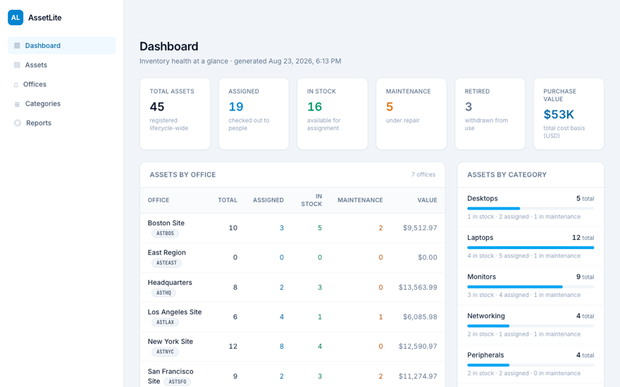
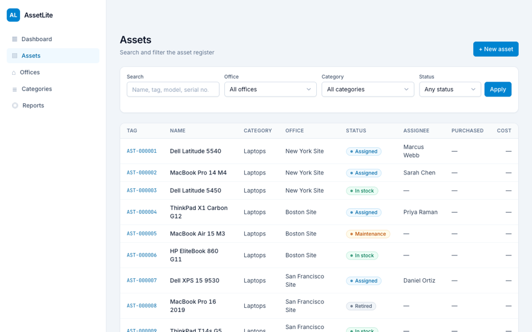
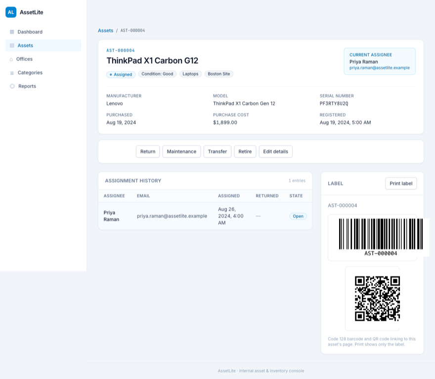

# AssetLite

**Track equipment across an organization's hierarchy, from purchase to retirement: who holds
each laptop, monitor or tablet, where every asset lives, and what state it is in today.**

[](https://github.com/Alex5350/assetlite/actions/workflows/ci.yml)
[](https://learn.microsoft.com/en-us/dotnet/core/whats-new/dotnet-10/overview)

> **Two ways to read this page.** Not an engineer? Everything below stays in plain language:
> the problem, the pictures, and what the product delivers; jargon links to the
> [glossary](docs/GLOSSARY.md). Engineer? The deep dive lives in [TECHNICAL.md](TECHNICAL.md):
> architecture, request flow, and every major decision mapped back to the business problem it
> solves.

## The problem

A growing company hands out laptops, monitors and tablets, then keeps hiring, and offices and
sites multiply. The spreadsheet drifts from reality within weeks: nobody can say for certain
who holds which device, which cupboard a retired laptop landed in, or whether anyone's records
still match the equipment actually in the building. IT staff stall an offboarding while they
hunt a leaver's hardware; office managers answer the same "where is it?" question by walking
the floor; and when auditors ask for the asset register, the answer is spreadsheet
archaeology.

AssetLite replaces that spreadsheet with a live registry: every asset tagged, filed under the
office hierarchy, and followed through its whole lifecycle, with corrections recorded rather
than erased.

## The product in pictures

| Dashboard: the estate at a glance | Assets: search the register | Label: a scannable barcode + QR |
|:---:|:---:|:---:|
|  |  |  |

## What it delivers

- **A live registry across the whole hierarchy.** Assets are filed under offices organized
  from HQ through regions to sites, so a search can cover one site or everything beneath a
  region, and reports roll up by office and category.
- **A lifecycle that keeps history.** Each asset moves in stock, assigned, maintenance,
  retired, disposed; hand-outs and hand-backs are recorded rather than overwritten, so "who
  had what, when" always has an answer.
- **A scannable label for every asset.** A barcode and QR label can be printed per asset; a
  phone scan of the QR code opens that asset's page.
- **Search and exports an auditor can actually use.** Search by tag, serial, name or model,
  filtered by office (including sub-offices), category and status; the full register exports
  to Excel and PDF, generated from the same data the screens read.

## How the engineering solves it

Plain-terms bridge; each item links to the full story in [TECHNICAL.md](TECHNICAL.md).

- **Nothing should stop a retired laptop being handed out again.** The lifecycle states are
  rules in the code, not conventions in a wiki: a move the lifecycle does not allow is
  rejected with a reason, instead of accepted and discovered later.
  ([how the tech solves it](TECHNICAL.md#how-the-tech-solves-the-business-problem))
- **"Everything under this region" should not be a spreadsheet formula.** The office
  hierarchy is built into the model itself, so scoping a search to a site and rolling totals
  up the tree are native operations, not report-writing exercises.
  ([the architecture](TECHNICAL.md#architecture))
- **Evaluating the whole system should take one command.** A single command starts the API,
  the web app and a dashboard with logs and health for both, so a reviewer's first hour goes
  into the product, not into setup.
  ([Aspire orchestration](TECHNICAL.md#how-the-tech-solves-the-business-problem))
- **"Error" is not an answer.** When a rule refuses a change, the refusal travels from the
  rule to the screen unchanged, so staff see why (this asset is retired, that office move
  would create a loop) in plain words.
  ([request flow](TECHNICAL.md#request-and-data-flow))

<details>
<summary><b>For developers: quickstart</b></summary>

Prerequisites: [.NET 10 SDK](https://dotnet.microsoft.com/download/dotnet/10.0),
[Node.js 22+](https://nodejs.org). Nothing else: SQLite migrates and seeds itself
(7 offices, 7 categories, 45 assets across every lifecycle state).

```bash
git clone https://github.com/Alex5350/assetlite.git
cd assetlite

# One-time: install the SPA's dependencies
cd frontend && npm install && cd ..

# One command: API (http://localhost:5060) + SPA (http://localhost:5070) + Aspire dashboard
dotnet run --project src/AssetLite.AppHost
```

The Aspire dashboard URL prints in the console (logs, traces and health for every resource,
SPA included). Prefer running pieces individually? `dotnet run --project src/AssetLite.Api`
for the API alone, or `cd frontend && npm start` for the SPA alone. The SPA's `aspire` npm
script honors the `$PORT` variable Aspire injects; `ng serve` won't read it on its own, and
that port handshake is what lets the Angular dev server live under the orchestrator
([ADR 0002](docs/adr/0002-aspire-orchestration.md) tells the full debugging story).

Tests:

```bash
dotnet run --project tests/AssetLite.Domain.UnitTests           # 208 domain tests
dotnet run --project tests/AssetLite.Application.UnitTests      # 84 application tests
dotnet run --project tests/AssetLite.Api.IntegrationTests       # 47 API integration tests
cd frontend && ng test --watch=false # 62 Angular tests (Vitest, no browser needed)
```

</details>

## Documentation

| Document | What it covers | Audience |
|---|---|---|
| [TECHNICAL.md](TECHNICAL.md) | Architecture, request flow, decisions mapped to business problems, stack rationale, testing | Engineers |
| [docs/GLOSSARY.md](docs/GLOSSARY.md) | Every term this repo uses, in plain English and precisely | Everyone |
| [docs/requirements-and-process.md](docs/requirements-and-process.md) | The problem as user requirements, and the build narrative | Engineers |
| [docs/adr/](docs/adr/) | Four architecture decision records | Engineers |

A personal reference application: a deliberate exercise in shipping a complete, tested,
full-stack product slice. It pairs with [LedgerLite](https://github.com/Alex5350/ledgerlite)
(REST/DDD), [LedgerLite Web](https://github.com/Alex5350/ledgerlite-web) (Blazor) and
[LeaveLite MCP](https://github.com/Alex5350/leavelite-mcp) as a set.

## License

[MIT](LICENSE)
