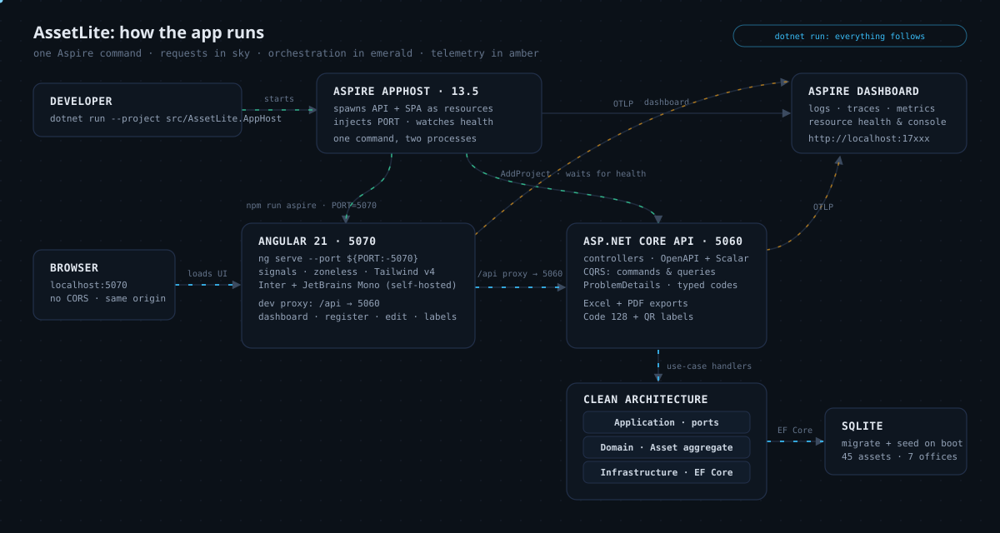

# AssetLite: the engineering view

The companion to the [README's product story](README.md): architecture, the request path, and
every major engineering decision traced back to the asset-tracking problem it exists to solve.
Decision records, requirements and the build narrative are linked throughout rather than
duplicated.

## Architecture



```
src/
├── AssetLite.Domain/            # Zero packages: aggregates, value objects,
│   │                            #   lifecycle state machine, domain events
├── AssetLite.Application/       # 20 CQRS use cases, ports, ErrorOr boundary mapping
├── AssetLite.Infrastructure/    # EF Core 10 + SQLite, Code 128 + QR labels,
│   │                            #   ClosedXML/QuestPDF exports, seeding
├── AssetLite.Api/               # Controllers (18 routes), ProblemDetails, OpenAPI
├── AssetLite.AppHost/           # Aspire orchestration: API + Angular dev server
└── AssetLite.ServiceDefaults/   # OpenTelemetry, service discovery, resilience
frontend/                        # Angular 21 SPA: signals, zoneless, Tailwind v4
tests/                           # 208 domain · 84 application · 47 integration
frontend/src/app/**/*.spec.ts    # 59 Vitest specs
```

- **AssetLite.Domain** holds every business rule: the `Asset` aggregate with its lifecycle
  state machine, `Office` hierarchy rules behind a domain service, value objects, domain
  events and specifications. Zero NuGet references.
- **AssetLite.Application** carries the 20 CQRS use cases over ports, and owns the one place
  domain failures become transport concerns (the ErrorOr boundary mapping).
- **AssetLite.Infrastructure** implements those ports: EF Core 10 over SQLite, repositories,
  the hand-rolled Code 128 encoder and QR labels, ClosedXML/QuestPDF exports, seeding.
- **AssetLite.Api** exposes 18 controller routes; ErrorOr results render as RFC 9457 problem
  details; OpenAPI is browsable via Scalar in Development.
- **AssetLite.AppHost + ServiceDefaults** orchestrate everything under one command and supply
  OpenTelemetry, service discovery and resilience defaults.
- **frontend/** is the Angular 21 SPA: signals everywhere, zoneless change detection, new
  control flow, typed models mirrored from the API DTOs.

**Layering rule:** dependencies point one way, Domain inward. The domain compiles and tests
with nothing installed; the same rules run under the API integration tests and behind every
screen.

## How the tech solves the business problem

| Business problem | Engineering decision | Why this tech | What it buys | Where documented |
|---|---|---|---|---|
| Evaluating a full-stack app should take one command, not a runbook | .NET Aspire orchestrates both processes: the API as a first-class project resource and the Angular dev server as a JavaScript-app resource (`WithHttpEndpoint(env: "PORT")` plus an `aspire` npm script that honors `$PORT`) | The first attempt failed three ways and was blamed on an upstream macOS/nvm defect; an isolated minimal repro found a plain port handshake miss, and the decision was reversed in public | `dotnet run` on the AppHost brings up API, SPA and the Aspire dashboard; the standalone flows remain as alternatives | [ADR 0002](docs/adr/0002-aspire-orchestration.md) |
| The API surface is the contract an enterprise team must review and secure | ASP.NET Core controllers over minimal APIs: four controllers under attribute routing, `ProducesResponseType` metadata, one shared ErrorOr-to-ProblemDetails base | A route table reviewable at a glance and metadata-rich OpenAPI beat per-endpoint wiring for a fixed resource model | 18 routes with uniform 400/404/409 semantics and a browsable OpenAPI document | [ADR 0001](docs/adr/0001-web-api-controllers-over-minimal-apis.md) |
| Business rules must stay testable without any framework | Zero-dependency domain: expected failures are values (`DomainError`, `DomainResult`), ErrorOr is mapped only at the Application boundary via C# 14 extension blocks | Transport semantics (404/409) belong at the boundary, not inside the most change-averse layer | 208 domain tests run on pure data with nothing installed; error codes are a stable, greppable contract shared by API responses and both test suites | [ADR 0004](docs/adr/0004-pure-domain.md) |
| Frontend tooling should be boring on purpose | TypeScript 5.9, the version Angular 21 installs and supports; TypeScript 7 evaluated and deferred, Angular 21 pinned over 22 for the same reason | Angular's tsgo bridge is unshipped and Angular 22 needs a newer Node than the toolchain standardizes on; no experimental compiler flags here | `ng build`/`ng test` run on fully supported versions; upgrading later is a `package.json` bump plus the migration guide | [ADR 0003](docs/adr/0003-typescript-version.md) |
| Illegal lifecycle moves must be rejected, not discovered later | The lifecycle is a state machine on the `Asset` aggregate; every transition is legal only from defined states and returns typed errors | Rules in code cannot be forgotten the way wiki conventions can | A retired laptop cannot be assigned; the refusal arrives as `Asset.CannotAssignRetired` with the reason attached | [process doc](docs/requirements-and-process.md) (R4) |
| Office scoping and rollups must respect the tree | The hierarchy is a domain concern: `IOfficeHierarchy` enforces single root, depth cap (4), acyclicity and no move under a descendant; search resolves office scopes (including all descendants) in the application layer | Scoping in the model means every query path inherits it, so the database query stays a flat `IN` filter | "Everything under this region" is one filter, and reports aggregate by office and category without special cases | [process doc](docs/requirements-and-process.md) (R2, R5) |
| Labels and exports must come from the same truth as the screens | Code 128 barcode encoder hand-rolled and verified against a computed known vector; QR codes encode the public asset URL; ClosedXML and QuestPDF exports generated server-side from the report queries | Zero barcode dependencies, and exports a browser does not have to generate can later be produced by a job, an email or an API client | Scannable labels per asset and an Excel/PDF register an auditor can use, generated from the same queries the UI reads | [process doc](docs/requirements-and-process.md) (R3, R6) |

The row that shaped the build most: the Aspire reversal. The JavaScript-app resource failed
identically through three launch paths, reproduced with a plain node process, and was
therefore concluded to be an upstream Aspire defect on macOS/nvm; partial adoption shipped on
that evidence. Two untested hypotheses remained (the endpoint was never declared; `ng serve`
ignores the `PORT` variable Aspire injects), and a minimal repro hosting only the JS resource
confirmed both: the dev server came up under the process monitor and stayed healthy once the
script honored `$PORT` and the endpoint was declared. The wrong conclusion is preserved in
[ADR 0002](docs/adr/0002-aspire-orchestration.md) on purpose: evidence that a configuration
fails is not evidence about whose defect it is.

Close behind it, the zero-dependency domain ([ADR 0004](docs/adr/0004-pure-domain.md)) is the
reason a refusal on screen names its cause. Because a failed rule returns a `DomainError`
value rather than throwing past the caller, the code travels intact through the boundary
mapping, into RFC 9457 problem details as the title, and out to the SPA panel: staff read why
the change was refused, not just that it was.

## What it demonstrates

| Area | Highlights |
|---|---|
| **Domain-Driven Design** | Zero-dependency domain layer: `Asset` aggregate with a full lifecycle state machine and typed error codes, `Office` hierarchy rules behind a domain service, value objects (`AssetTag`, `Money`), domain events, specifications |
| **Clean Architecture** | Domain ← Application (CQRS handlers, ports) ← Infrastructure (EF Core 10 + SQLite) ← API; the domain tests run on pure data with nothing installed |
| **ASP.NET Core Web API** | Controllers with RFC 9457 ProblemDetails carrying domain codes (400/404/409), OpenAPI + Scalar, integration tests over `WebApplicationFactory` |
| **Barcode generation** | Hand-rolled **Code 128 SVG encoder** verified against a computed known vector, plus QR labels encoding the public asset URL; zero barcode dependencies |
| **Excel & PDF exports** | ClosedXML register with styled totals; QuestPDF landscape report with headers and page numbers, generated server-side, downloadable from the UI |
| **Angular 21** | Signals everywhere, zoneless change detection, new control flow, standalone lazy routes, typed models mirrored from the API DTOs |
| **Tailwind CSS v4** | Design tokens (status colors for the five lifecycle states) and a small component layer over utilities |
| **Testing** | 339 backend (domain/application/integration incl. byte-level `%PDF`/`PK` export checks) + 62 frontend: the frontend suite caught two real bugs (documented) |
| **Aspire** | One command runs API, Angular dev server and dashboard, after a documented misdiagnosis and the real fix (ADR 0002) |

## Request and data flow

One representative path: assigning an asset to a person.

1. The browser calls the SPA's own origin; under the AppHost the Angular dev server proxies
   `/api` to the API on 5060, so the SPA never crosses origins.
2. The Assets controller binds the request (attribute routing under `api/`, JSON enum
   conversion, strongly typed ids as raw GUID strings) and dispatches to the `ICommandHandler`
   for the use case.
3. The handler loads the `Asset` aggregate through a repository port, then calls the domain
   method (`AssignTo`); the lifecycle state machine decides legality, nothing else.
4. A refusal returns as a `DomainError(code, message)` value; the Application layer maps it
   (codes ending in `NotFound` to 404, everything else to 409) and the controller emits an
   RFC 9457 problem detail carrying the code as the title.
5. On success, EF Core persists the aggregate including the new assignment-history row and the
   domain events; the SPA renders the returned DTO, or the error panel, with the reason
   unchanged from the rule that produced it.

Query paths differ only in step 3: search parameters resolve office scopes (including all
descendants) to a flat office-id list in the application layer, and the report queries that
feed the dashboard are the same ones the Excel/PDF exports read.

## Stack, and why

| Area | Choice and why |
|---|---|
| **.NET 10 / C# 14** | ASP.NET Core Web API via controllers: the reviewable, metadata-rich contract surface ([ADR 0001](docs/adr/0001-web-api-controllers-over-minimal-apis.md)); EF Core 10 + SQLite self-migrating and seeded, so clone-and-run holds (R8) |
| **Zero-dependency domain** | `DomainResult` values with ErrorOr mapped at the boundary: business rules testable without any framework ([ADR 0004](docs/adr/0004-pure-domain.md)) |
| **Aspire 13.5** | One command for API, SPA and dashboard; OpenTelemetry, service discovery and resilience via ServiceDefaults ([ADR 0002](docs/adr/0002-aspire-orchestration.md)) |
| **Angular 21 / TypeScript 5.9** | Signals-first, zoneless, new control flow; compiler versions Angular fully supports, boring on purpose ([ADR 0003](docs/adr/0003-typescript-version.md)) |
| **Tailwind CSS v4** | Design tokens (status colors for the five lifecycle states) over a small component layer |
| **Labels and exports** | Hand-rolled Code 128 SVG encoder (known-vector verified, zero barcode packages), QRCoder QR labels, ClosedXML Excel register, QuestPDF landscape PDF |
| **Testing** | xUnit v3, NSubstitute, WebApplicationFactory; Vitest for the SPA |

## Testing

Four suites, 339 backend tests plus 62 Angular tests, each protecting something specific:

- **208 domain tests** on pure data, nothing installed: every lifecycle transition and its
  rejections, office hierarchy rules, value object parsing. The payoff of
  [ADR 0004](docs/adr/0004-pure-domain.md).
- **84 application tests** over ports with NSubstitute fakes: the 20 CQRS use cases and the
  ErrorOr boundary mapping.
- **47 API integration tests** over `WebApplicationFactory`: all 18 routes, the RFC 9457
  mappings, and byte-level `%PDF`/`PK` export checks.
- **62 frontend tests** (Vitest, no browser needed) across 59 spec files: the suite caught
  two real SPA bugs before any human clicked; the spec files document the regressions they
  guard.

## The process, in brief

The commit history is the real build log; this is the short version of how it went. The long
version, with every decision and failure, is in the
[process doc](docs/requirements-and-process.md) and the [ADRs](docs/adr/).

- **Requirements before code.** Eight user-level requirements (R1-R8) were written first;
  each one shaped a concrete design choice: the lifecycle state machine, the office
  hierarchy domain service, server-driven paging.
- **The UI that passed every test but rendered unstyled.** For part of the build, Tailwind
  compiled nothing: the Angular CLI only auto-detects `.postcssrc.json`, and the repo carried
  a `postcss.config.mjs`. Every spec stayed green because none assert computed styles; the
  truth came from reading the bytes the browser actually received.
- **A misdiagnosis, corrected in public.** Aspire's JavaScript-app resource was first
  rejected as an upstream macOS/nvm defect. A minimal repro later, the real cause was a port
  handshake: Aspire injects `PORT`, `ng serve` ignores it. The reversal (wrong conclusion
  included) is preserved in [ADR 0002](docs/adr/0002-aspire-orchestration.md).
- **The SPA's tests caught the SPA's bugs.** Forms bound `(ngSubmit)` without `FormsModule`
  (a native submit would have reloaded the page), and a success notice cleared itself before
  render; both found by the frontend suite before any human clicked.
- **Contract drift hurts both ways.** Live-testing caught the SPA sending `searchText` where
  the API expected `search`, plus a handful of smaller mismatches; DTOs are now mirrored from
  source and pinned by tests on both sides.
- **Deliberate non-adoptions.** TypeScript 7 (Angular's tsgo bridge unshipped), Angular 22
  (needs Node ≥ 22.22) and MediatR (a hand-rolled dispatcher is ~60 lines) were each
  evaluated and declined, with reasons in the ADRs.
- **Libraries fought back.** QuestPDF's 2026 API reshuffle and EF Core's refusal to
  translate `string.Contains` over value-converted columns both needed working around
  (current fluent API; a composable `FromSqlInterpolated` predicate).

## Security and operations

- **CI on every push and PR** ([ci.yml](.github/workflows/ci.yml)): Release build with
  warnings as errors, then all three backend suites, plus the frontend production build and
  its Vitest run. A docs-only change rides the same gate.
- **One error contract on every route**: the shared `ApiControllerBase` maps ErrorOr to
  RFC 9457 problem details uniformly, so no endpoint invents its own failure shape
  ([ADR 0001](docs/adr/0001-web-api-controllers-over-minimal-apis.md)).
- **The API contract is reviewable by construction**: OpenAPI generated from controller
  metadata, browsable via Scalar at `/scalar/v1` in Development.
- **Operations are configuration, not code**: SQLite migrates and seeds itself on first run;
  the API and SPA run under Aspire or standalone (`dotnet run --project src/AssetLite.Api`,
  `npm start`); exports are generated server-side, so the same files can later be produced by
  a job, an email or an API client rather than only a browser.

## Jargon

Terms used across this repo, from [aggregate](docs/GLOSSARY.md) and
[value object](docs/GLOSSARY.md) to [Aspire orchestration](docs/GLOSSARY.md) and
[RFC 9457 problem details](docs/GLOSSARY.md), are defined in the
[glossary](docs/GLOSSARY.md), plain English first.
